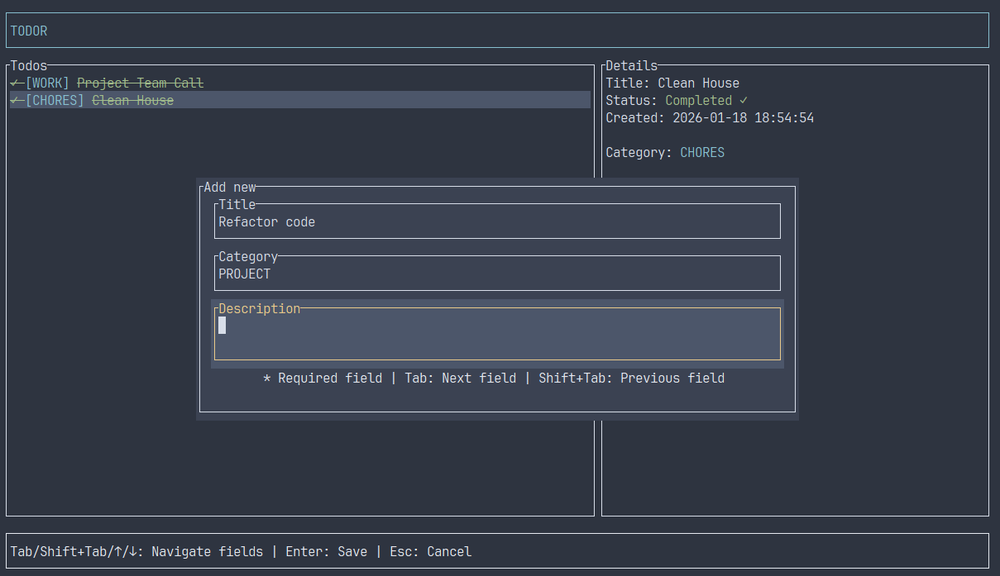
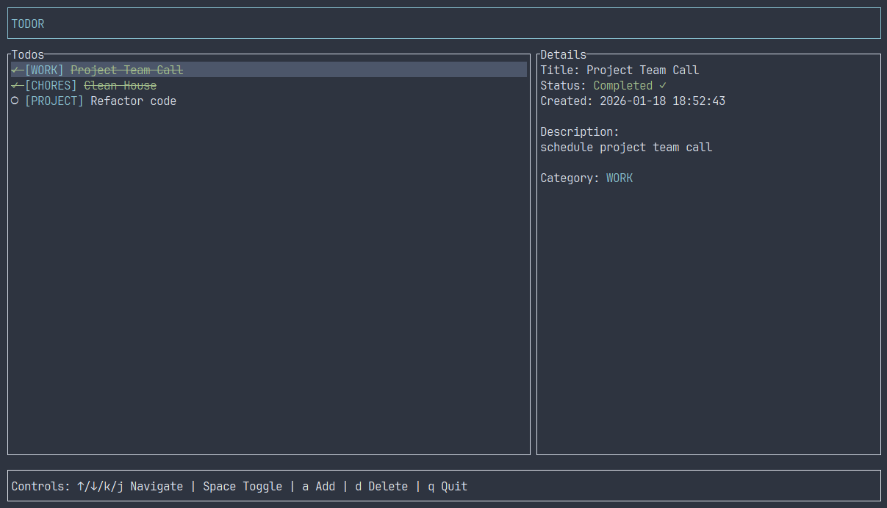

# TODOR


A terminal-based todo application built with Rust and Ratatui.

## SCRENNSHOTS




## Installation

```bash
git clone <repository-url>
cd todor
cargo install --path .
```

This installs the `todor` binary to `~/.cargo/bin/`. Make sure `~/.cargo/bin` is in your PATH:

```bash
# Add to your shell profile (.bashrc, .zshrc, etc.)
export PATH="$HOME/.cargo/bin:$PATH"
```

## Data

Todos are automatically saved to `./config/todor/todos.json`.
